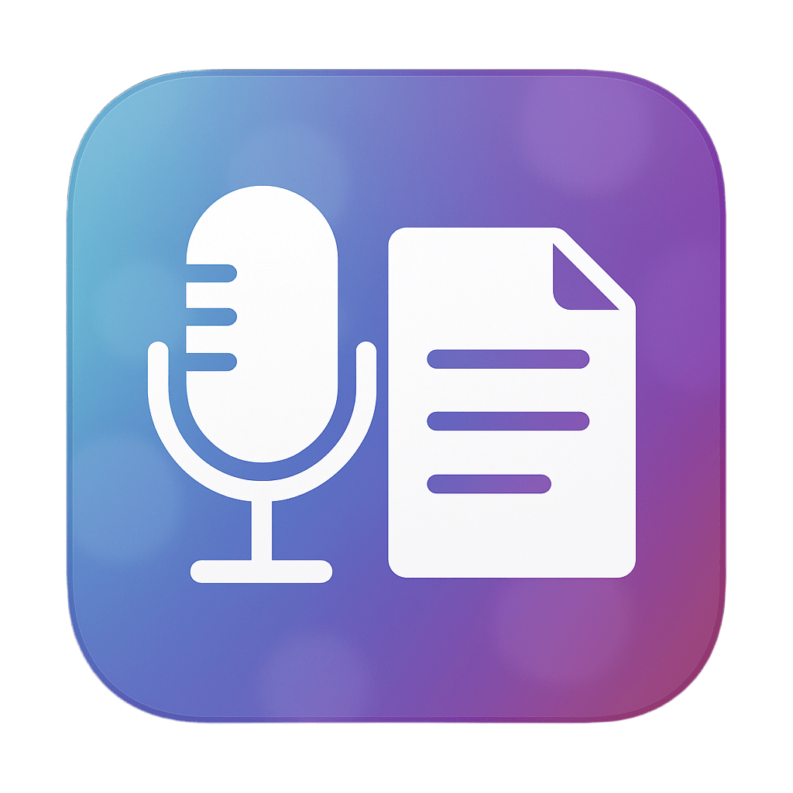

<p align="center">
   
</p>

<p align="center">
   <a href="https://github.com/zangjiucheng/Voice-Notes">
      
   </a>
   <a href="https://github.com/zangjiucheng/Voice-Notes/actions/workflows/test.yml">
      
   </a>
   <a href="https://pypi.org/project/voice-notes/">
      
   </a>
   <br>
   <a href="https://www.python.org/">
      
   </a>
   <a href="https://pypi.org/project/PyQt6/">
      
   </a>
</p>

# Voice Notes

A modern audio recording and transcription app with AI-powered note-taking.


## ✨ Features

- 🎙️ **Audio Recording** - Record from any input device with real-time monitoring
- 🤖 **AI Transcription** - Multiple Whisper models for accurate transcription
- 📝 **Smart Notes** - Time-anchored notes with word-level synchronization
- 🎨 **Modern UI** - Beautiful glassmorphism design
- 🖥️ **Cross-Platform** - macOS, Windows, Linux support

## 🚀 Installation

```bash
pip install voice-notes
voice-notes
```

## 📖 Usage

1. **Record** - Use the Record tab to capture audio
2. **Transcribe** - Process audio with AI transcription
3. **Playback** - Listen with synchronized word highlighting
4. **Notes** - Take time-anchored notes during playback

### Keyboard Shortcuts
- `Space` - Play/Pause
- `Ctrl+N` / `Cmd+N` - New recording
- `Ctrl+V` - Import audio

## 🛠️ Development

```bash
git clone https://github.com/zangjiucheng/Voice-Notes.git
cd Voice-Notes
pip install -r requirements.txt
pip install -e .
voice-notes
```

## 📄 License

MIT License - see [LICENSE](LICENSE) for details.