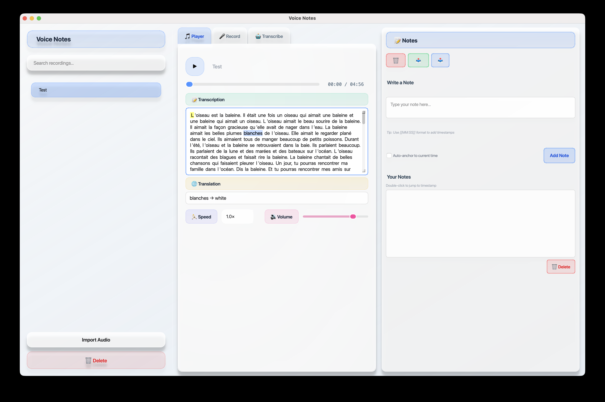

<p align="center">
   <a href="https://github.com/zangjiucheng/Voice-Notes">
      
   </a>
   <a href="https://github.com/zangjiucheng/Voice-Notes/blob/main/LICENSE">
      
   </a>
   <br>
   <a href="https://www.python.org/">
      
   </a>
   <a href="https://pypi.org/project/PyQt6/">
      
   </a>
   <a href="https://pypi.org/project/faster-whisper/">
      
   </a>
   <a href="https://github.com/jiucheng/transcribe-note">
      
   </a>
</p>

# Voice Notes

A sophisticated audio recording, playback, and transcription application built with PyQt6, featuring modern glassmorphism design, AI-powered transcription, and comprehensive note-taking capabilities.


*Main application interface showing the horizontal layout with Media tabs (Player, Record, Transcribe) on the left and Notes panel on the right.*

## Project Structure

```
voice-notes/
├── main.py                      # Application entry point (for development)
├── voice_notes/                 # Main package
│   ├── __init__.py
│   ├── app.py                   # Application core and initialization
│   ├── core/                    # Business logic and services
│   │   ├── __init__.py
│   │   ├── config.py            # Application constants and settings
│   │   ├── audio_devices.py     # Audio device enumeration and management
│   │   ├── audio_library.py     # Audio file operations and library management
│   │   ├── notes_manager.py     # Notes storage, retrieval, and time anchoring
│   │   ├── recorder.py          # Audio recording thread with level monitoring
│   │   ├── transcribe.py        # Transcription service integration
│   │   └── transcription.py     # Whisper transcription processing
│   ├── ui/                      # User interface layer
│   │   ├── __init__.py
│   │   └── main_window.py       # Main application window and layout
│   ├── widgets/                 # Reusable UI components
│   │   ├── __init__.py
│   │   ├── library_widget.py    # File browser, search, and import functionality
│   │   ├── media_widget.py      # Tabbed interface for Player, Recorder, and Transcription
│   │   ├── notes_widget.py      # Notes editing, export/import, and global actions
│   │   ├── player_widget.py     # Audio playback with word-level highlighting
│   │   ├── recorder_widget.py   # Recording controls and device selection
│   │   └── transcription_widget.py # Transcription model selection and processing
│   ├── styles/                  # Styling and theming
│   │   ├── __init__.py
│   │   └── theme.py             # Comprehensive glassmorphism QSS theme
│   └── utils/                   # Utility functions and helpers
│       ├── __init__.py
│       ├── helpers.py           # Time formatting and text utilities
│       └── platform.py          # Platform-specific effects and optimizations
├── recordings/                  # Audio recordings (auto-created)
├── outputs/                     # Notes and transcription files (auto-created)
├── session_media/               # Temporary session files
├── requirements.txt             # Python dependencies
├── pyproject.toml               # Package configuration
├── README.md                    # This file
├── LICENSE                      # MIT License
├── .gitignore                  # Git ignore rules
└── screenshots/                # Application screenshots (optional)
    ├── app-overview.png        # Main application interface
    └── transcription-highlighting.png # AI transcription with word highlighting
```

## Features

- **🎨 Modern Glassmorphism UI** - Beautiful translucent design with soft gradients and shadows
- **🎵 Advanced Audio Recording** - Record from any input device with real-time level monitoring
- **▶️ Intelligent Audio Playback** - Full-featured player with speed control, seeking, and word-level highlighting
- **📝 Smart Note-Taking** - Time-anchored notes with automatic word-level timing synchronization
- **🤖 AI-Powered Transcription** - Multiple Whisper model sizes with real-time word highlighting during playback
- **📚 Library Management** - Search, organize, and delete recordings with intuitive file browser
- **🔄 Tabbed Media Interface** - Combined Player, Recorder, and Transcription in organized tabs
- **💾 Export/Import** - Save and load notes in multiple formats
- **🎯 Word-Level Highlighting** - Visual feedback showing current word position during audio playback
- **🖥️ Cross-Platform** - Native support for macOS, Windows, and Linux
- **⚡ Fast Transcription** - Optimized Whisper integration with faster-whisper for quick processing

## Installation

### Prerequisites
- Python 3.9 or higher
- pip package manager

### Install from PyPI (Recommended)

```bash
pip install voice-notes
```

Then run:
```bash
voice-notes
```

### Install from Source

**Clone the repository:**
```bash
git clone https://github.com/zangjiucheng/Voice-Notes.git
cd Voice-Notes
```

**Install dependencies:**
```bash
pip install -r requirements.txt
```

**Or install manually:**
```bash
# Core UI framework
pip install PyQt6 PyQt6-Qt6 PyQt6-sip

# Audio processing
pip install sounddevice soundfile pydub numpy

# AI transcription (choose one)
pip install faster-whisper  # Recommended: faster and more efficient
# OR
pip install openai-whisper  # Alternative: original OpenAI implementation
```

### Optional: macOS Enhancements
```bash
pip install pyobjc-framework-Cocoa  # For native macOS vibrancy effects
```

## Usage

### Getting Started

**Launch the application:**
```bash
voice-notes
```

**Or from source:**
```bash
python main.py
```

### Interface Overview

The application features a horizontal layout with two main panels:

- **Left Panel (Media)**: Tabbed interface containing:
  - **Player Tab**: Audio playback with word-level highlighting
  - **Record Tab**: Audio recording with device selection
  - **Transcribe Tab**: AI transcription with model selection

- **Right Panel (Notes)**: Note-taking interface with:
  - Rich text editor for notes
  - Export/import functionality
  - Global action buttons (Clear All, Export, Import)

### Keyboard Shortcuts

- `Space` - Play/Pause audio
- `Ctrl+N` (or `Cmd+N` on macOS) - Start new recording
- `Ctrl+V` - Import audio files
- `Delete` - Remove selected recording (with confirmation)

### Workflow

1. **Record Audio**: Switch to Record tab, select input device, and start recording
2. **Transcribe**: Switch to Transcribe tab, select Whisper model, and process audio
3. **Playback**: Switch to Player tab to play audio with synchronized word highlighting
4. **Take Notes**: Use the Notes panel to add time-anchored notes during playback
5. **Export**: Save your notes and transcriptions for later use

## Architecture Benefits

### Advanced Modular Design
- **Separation of Concerns**: Business logic, UI, and utilities are cleanly separated
- **Component-Based**: Reusable widgets with clear interfaces and responsibilities
- **Service-Oriented**: Core services (transcription, audio, notes) are independent modules
- **Centralized Theming**: All styling managed through a single QSS theme file

### Enhanced User Experience
- **Tabbed Media Interface**: Organized workflow with Player, Recorder, and Transcription tabs
- **Word-Level Highlighting**: Visual feedback during audio playback for better synchronization
- **Horizontal Layout**: Efficient use of screen space with side-by-side panels
- **Glassmorphism Design**: Modern, translucent UI with consistent theming across all dialogs

### Developer Experience
- **Maintainable Codebase**: Clear structure with logical file organization
- **Easy Testing**: Modular components can be tested independently
- **Extensible Architecture**: Simple to add new features or modify existing ones
- **Type Hints**: Python type annotations for better code documentation
- **Cross-Platform**: Platform-specific optimizations and effects

### Performance & Reliability
- **Optimized Transcription**: Faster-whisper integration for quick AI processing
- **Efficient Audio Handling**: Real-time level monitoring and device management
- **Robust File Management**: Comprehensive library with search and cleanup
- **Error Handling**: Proper exception handling and user feedback

## Development Status

This application has evolved from a single-file script into a professional, modular PyQt6 application with:

- ✅ Complete modular architecture with 20+ organized files
- ✅ Advanced glassmorphism UI with consistent theming
- ✅ AI-powered transcription with multiple model support
- ✅ Word-level highlighting during audio playback
- ✅ Comprehensive audio library management
- ✅ Cross-platform compatibility
- ✅ Export/import functionality for notes
- ✅ Horizontal layout optimization
- ✅ Centralized QSS theming for all components

The codebase follows modern Python practices with proper package structure, type hints, and comprehensive documentation.

## Recent Enhancements

### v2.0 Features
- **Tabbed Media Widget**: Combined Player, Recorder, and Transcription in organized tabs
- **Word-Level Highlighting**: Yellow background highlighting of current words during playback
- **Enhanced UI Layout**: Horizontal arrangement for better space utilization
- **Separate Transcription Widget**: Dedicated transcription interface with model selection
- **Improved Dialog Styling**: Glassmorphism theming for all popup dialogs
- **Advanced Library Management**: Delete functionality with confirmation dialogs
- **Global Action Buttons**: Clear All, Export, and Import functionality in Notes panel
- **Optimized Performance**: Faster-whisper integration for improved transcription speed
- **Comprehensive Theming**: Centralized QSS with objectName-specific selectors

### Technical Improvements
- **Modular Architecture**: 20+ files organized in logical packages
- **Enhanced Error Handling**: Better user feedback and exception management
- **Platform Optimizations**: macOS-specific effects and cross-platform compatibility
- **Code Quality**: Type hints, documentation, and clean separation of concerns
- **UI Consistency**: Matching backgrounds, rounded corners, and unified styling

## License

This project is licensed under the MIT License - see the [LICENSE](LICENSE) file for details.

## Contributing

Contributions are welcome! Please feel free to submit a Pull Request. For major changes, please open an issue first to discuss what you would like to change.

### Development Setup
1. Fork the repository
2. Create a virtual environment: `python -m venv venv`
3. Activate the environment: `source venv/bin/activate` (Linux/macOS) or `venv\Scripts\activate` (Windows)
4. Install dependencies: `pip install -r requirements.txt`
5. Install in development mode: `pip install -e .`
6. Run the application: `voice-notes`

### Code Style
- Follow PEP 8 guidelines
- Use type hints for function parameters and return values
- Add docstrings to classes and methods
- Keep functions focused on single responsibilities

## Module Overview

### Core Modules

- **`config.py`** - Application constants, file paths, UI settings, and configuration
- **`audio_library.py`** - Audio file operations, library management, and file cleanup
- **`notes_manager.py`** - Notes storage, retrieval, time anchoring, and export/import
- **`recorder.py`** - Audio recording thread with real-time level monitoring
- **`transcription.py`** - Whisper integration and transcription processing
- **`transcribe.py`** - Transcription service wrapper and model management
- **`audio_devices.py`** - Audio device enumeration, selection, and validation

### UI Components

- **`main_window.py`** - Main application window with horizontal layout and splitter
- **`media_widget.py`** - Tabbed container for Player, Recorder, and Transcription widgets
- **`player_widget.py`** - Audio playback controls with word highlighting and seeking
- **`recorder_widget.py`** - Recording interface with device selection and level display
- **`transcription_widget.py`** - Transcription controls with model selection and progress
- **`notes_widget.py`** - Notes editor with export/import and global actions
- **`library_widget.py`** - File browser with search, import, and deletion functionality

### Utilities

- **`helpers.py`** - Time formatting, text parsing, and utility functions
- **`platform.py`** - Platform-specific effects, shadows, and optimizations
- **`theme.py`** - Comprehensive glassmorphism QSS stylesheet with dialog styling

## Migration from Single File

The original `voice_notes_glass.py` has been completely refactored into this structured approach while maintaining 100% feature compatibility. The new architecture provides:

- Better separation of concerns
- Easier testing and debugging
- More maintainable codebase
- Cleaner code organization
- Enhanced extensibility

To use the new version, simply run `python main.py` instead of the old single file.